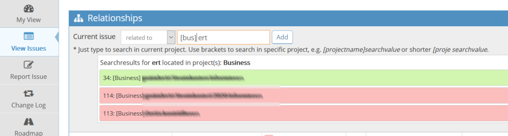

# MantisBT Relator Plugin

Overview
--------

The Relator plugin implements a live search for related issues to support easy relation creation without the need to know the corresponding ticket id.
It's inspired by the SearchRelatedIssue Plugin from brlumen.

Screenshots
-----------

Features
--------
- Create ticket relations without the need to know the ticket ID.
- Search for tickets in the current project.
- Supports to search in other projects be specify the project name in brackets.
- Supports to select projects just with beginning letters.
- Supports to select projcts with whitespaces using the closing bracket.

Download
--------
Please download the stable version.
(https://github.com/maximilianriess/relator/releases/latest)

How to install
--------------

1. Copy Relator subfolder (which contains files, lang, pages, Relator.php) into plugins folder.
2. Open Mantis with browser.
3. Log in as administrator.
4. Go to Manage -> Manage Plugins.
5. Find Relator in the list.
6. Click Install.

Supported Versions
------------------

- MantisBT 2.14 and higher - supported
